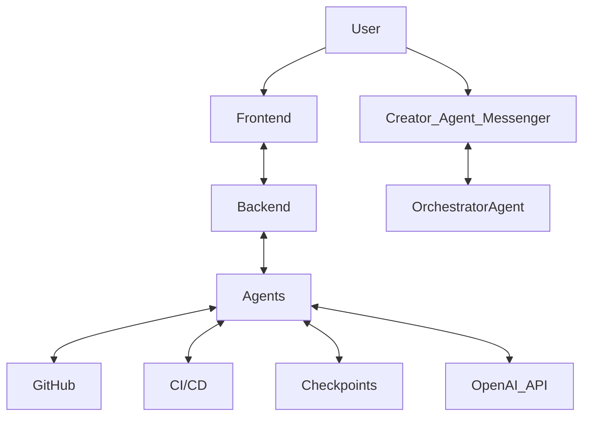

# Project Architecture: Self-Building Site

## Overview

This project aims to create an autonomous, self-improving multi-agent system that designs, builds, tests, and deploys a public-facing website for humanity-benefitting projects. The system emphasizes transparency, safety, and modularity.

## High-Level Architecture

The system will consist of a frontend, a backend, and a multi-agent framework. The frontend will be a Next.js application, the backend a Python FastAPI application, and the agents will operate within a dedicated `agents/` directory.



## Agent Hierarchy

*   **OrchestratorAgent**: The central coordinator. Manages tasks, dispatches to other agents, enforces constraints, and handles communication with the Creator-Agent Messenger.
*   **BuilderAgent**: Responsible for code generation, scaffolding, and implementing new features based on the Orchestrator's directives.
*   **TesterAgent**: Focuses on ensuring code quality, running unit and end-to-end tests, and validating functionality.
*   **CriticAgent**: Reviews proposed changes, ensures adherence to principles and coding standards, and provides feedback for improvements.
*   **MetaAgent (Future)**: Will track and optimize inter-agent workflows, flagging entropy or misalignment.

## Repository Structure

```
selfbuilding-site/
├── ARCHITECTURE.md
├── README.md
├── .github/
│   └── workflows/  # CI/CD pipelines (GitHub Actions)
├── frontend/       # Next.js + TailwindCSS application
│   ├── public/
│   ├── src/
│   └── ...
├── backend/        # Python FastAPI application
│   ├── app/
│   ├── tests/
│   └── ...
├── agents/         # Multi-agent framework
│   ├── orchestrator/
│   ├── builder/
│   ├── tester/
│   ├── critic/
│   └── ...
├── checkpoints/    # Architectural checkpoints and change logs
├── logs/           # Agent activity logs
├── principles/     # JSON files for core principles
│   └── principles.json
├── tests/          # E2E tests (separate from agent-specific tests)
└── .env.example    # Environment variables
```

## Key Components & Technologies

*   **Frontend**: Next.js, React, TailwindCSS
*   **Backend**: FastAPI, Python
*   **Agents**: Python
*   **Version Control**: Git, GitHub
*   **CI/CD**: GitHub Actions
*   **Deployment**: Vercel (Frontend), Render.com (Backend)
*   **Real-time Communication**: WebSockets (for Creator-Agent Messenger)
*   **Database**: Postgres (for Community Input module)
*   **Code Quality**: Prettier, ESLint (frontend), Black, Ruff (backend)

## Requirements Validation & Adjustments

All requirements seem feasible within the given constraints. The proposed architecture and repository structure directly support the objective and deliverables. No major adjustments are suggested at this stage.

## Next Steps

Proceed to Phase 1: Minimum viable skeleton.

